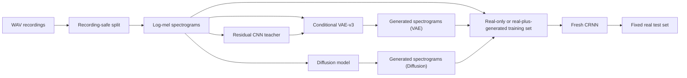

# Project Report Outline

## Document status and constraints

- **Purpose:** Working outline for the final project report.
- **Template:** [`Report_Template.tex`](Report_Template.tex).
- **Submission deadline:** August 14, 11:30 PM.
- **Main-body limit:** At most 5 pages. Appendices and references are excluded.
- **Target compiled length:** Approximately 4.7 pages, leaving about 0.3 pages of formatting margin.
- **Current source of project facts:** `main` at commit `89c3bcc`; the current technical implementation is inherited from `5a79085`.
- **Current writing scope:** Data preparation, Residual CNN, CRNN, and VAE.
- **Deferred scope:** Do not use the implementation details from `diffusion_vincent` yet. Keep the corresponding Diffusion model headings empty for later completion, while defining the shared comparison and timing protocol now.

### Approved compression plan

- Keep the main body at or below five pages; references and appendices may extend the compiled document beyond five pages.
- Keep only the pipeline figure, the VAE generated-sample figure, and the primary low-resource result table in the main body.
- Describe the V1--V3 evolution in compact prose rather than a separate table.
- Retain one compact VAE objective equation; move architecture minutiae, complete loss derivations, training hyperparameters, leakage audit details, sampling-temperature provenance, and the full timing procedure to the appendix.
- Merge repeated limitations across methodology, results, discussion, and conclusion.
- Target approximately seven compiled pages including references and a short appendix.

## Confirmed reporting strategy

### Primary research question

> Can generated samples improve bird-species classification in a low-resource setting?

The primary endpoint is the change in macro-F1 of a newly initialized CRNN evaluated on the same fixed real test set:

\[
\Delta F1 = F1_{\text{real+generated}} - F1_{\text{real-only}}.
\]

### Secondary research question

> Under a matched protocol, how do VAE and Diffusion differ in generated-sample quality and in the time required to generate the same number of samples?

The quality comparison should consider class conditioning, distribution similarity, diversity and coverage, copying risk, generation-seed stability, spectrogram inspection, and listening. Generation efficiency must be reported separately as both an absolute time gap and a Diffusion-to-VAE time ratio under identical hardware, output count, batch size, precision, and timing boundaries. The VAE side and common protocol can be drafted now; the Diffusion implementation and measured comparison remain empty until that work is added.

### Claim boundary

- The strongest current result concerns **classifier utility**, not perceptual audio realism.
- VAE reconstruction metrics and generated-sample diagnostics must be kept separate from downstream CRNN macro-F1.
- Agreement with a classifier that participated in VAE training is a consistency diagnostic, not independent evidence of realism.
- The low-resource study simulates label scarcity for three project species while using pretrained generators. It is not a strict rare- or unseen-species experiment.
- A faster generator is not necessarily a better generator; quality, downstream utility, and runtime are three separate outcomes.
- The current generators natively produce log-mel spectrograms. A claim about **audio-file generation time** must additionally include the same spectrogram-to-waveform decoder for both models.

## Main-body page budget

| Content | Target length |
|---|---:|
| Abstract and Attestation of Teamwork | 0.35 page |
| Introduction and Problem Formulation | 0.65 page |
| Data Preparation | 0.45 page |
| System Design and Models | 1.20 pages |
| Experimental Methodology | 0.40 page |
| Numerical Experiments | 1.10 pages |
| Discussion and Conclusion | 0.55 page |
| **Estimated total** | **4.70 pages** |

References and appendices are outside this budget.

---

## Front matter

### Working title

**BirdGEN: Conditional Bird-Song Spectrogram Generation for Rare Species Classification**

In the report text, clarify that rare-species recognition is the intended application, whereas the recorded experiment simulates labeled-data scarcity for three project species using pretrained generators. Do not convert the title into a claim that the generator was trained on truly rare or unseen species.

### Confirmed author block

- **Shenghao Jin**, Department of Electrical and Computer Engineering, University of Toronto, `shenghao.jin@mail.utoronto.ca`
- **Harvey Li**, Department of Electrical and Computer Engineering, University of Toronto, `harv.li@mail.utoronto.ca`
- **Vincent Wang**, Department of Electrical and Computer Engineering, University of Toronto, `vz.wang@mail.utoronto.ca`

### Abstract

The abstract should contain four elements:

1. **Motivation:** Real bird-song collection and annotation are costly, motivating conditional generation as a source of additional training data.
2. **Task:** Generate three-second log-mel spectrograms for American Robin, Northern Cardinal, and Song Sparrow.
3. **Methods:** Recording-safe data preparation, classifier selection, a class-conditional spatial VAE, a deferred conditional Diffusion model, and matched low-resource CRNN evaluation.
4. **Main conclusion:** The recorded VAE-v3 augmentation experiment improved mean test macro-F1 in the matched label-scarcity setting, while classifier and pixel-space diagnostics do not by themselves establish waveform realism.

Avoid putting an exact generated-to-test MSE in the abstract until that metric has been recomputed from a verified generation pipeline.

### Attestation of Teamwork

Correct the template heading from `Assentation` to `Attestation` and use the following concise paragraph:

> Shenghao Jin contributed to data preparation and to the development and evaluation of the conditional VAE. Harvey Li contributed to data preparation, developed and evaluated the Residual CNN and CRNN classifiers, conducted the low-resource synthetic augmentation experiments, and conducted the matched VAE--Diffusion generation-time comparison. Vincent Wang developed and evaluated the conditional diffusion model. All members contributed to the preparation and revision of the final report.

---

## 1. Introduction

### 1.1 Motivation

- Bird-song recordings are expensive to collect, clean, and label.
- A classifier trained with few labeled examples can be sensitive to class imbalance and limited recording diversity.
- Conditional generative models may provide additional class-specific spectrograms for training.
- Generator evaluation should therefore ask both whether samples resemble the target data and whether they improve learning on unseen real recordings.

### 1.2 Project scope

- Target species: American Robin, Northern Cardinal, and Song Sparrow.
- Shared high-level representation: three-second, single-channel, `128 x 128` log-mel spectrograms.
- Models covered in the current draft: Residual CNN, CRNN, and VAE-v3.
- The Diffusion section remains structurally present but empty.

### 1.3 Contributions

1. Constructed recording-ID-isolated train, validation, and test manifests and preserved a content-safe evaluation version.
2. Compared multiple classifier architectures and selected a compact CRNN using validation evidence.
3. Developed a species-conditioned spatial VAE with detail-aware and classifier-consistency objectives.
4. Evaluated whether synthetic samples improve a freshly trained CRNN under a matched low-resource protocol.
5. Defined a common generated-sample quality protocol that can later compare VAE and Diffusion.
6. Designed an equal-count benchmark that separates model sampling time from shared spectrogram-to-waveform decoding time.

---

## 2. Preliminaries and Problem Formulation

### 2.1 Conditional generation

Given a class label \(y\) and latent variable \(z\), a conditional generator produces a spectrogram

\[
\hat{x} = G(z, y).
\]

The goal is not merely to produce visually plausible arrays. Generated samples should preserve species-relevant structure, remain diverse, avoid copying training examples, and ideally improve a classifier evaluated on untouched real data.

### 2.2 Primary downstream task

Compare two matched pipelines:

- `real-only training data -> fresh CRNN -> fixed real test set`
- `real + generated training data -> fresh identical CRNN -> same fixed real test set`

Primary metrics:

- Macro-F1
- Per-species F1 and recall
- Balanced accuracy or standard accuracy
- Confusion matrix
- Paired \(\Delta F1\) across matched experimental blocks

### 2.3 Secondary generation-quality task

Use common metrics that can be applied to both VAE and Diffusion:

- Generated-to-real pixel-space similarity
- Class-conditioning agreement with an independent CRNN
- Classifier-feature distribution distance
- Diversity and coverage
- Nearest-neighbor copying risk
- Generation-seed stability
- Qualitative spectrogram and audio inspection

No single metric should be treated as a complete realism score.

---

## 3. Data Preparation

### 3.1 Dataset summary

The audited target subset contains 3,347 clips from 310 original recording IDs:

| Species | Clips | Recording IDs |
|---|---:|---:|
| American Robin | 1,017 | 81 |
| Northern Cardinal | 1,074 | 92 |
| Song Sparrow | 1,256 | 137 |
| **Total** | **3,347** | **310** |

The historical split contains 2,339 training, 519 validation, and 489 test clips. The later `content_safe_v2` manifests preserve validation and test while removing 24 duplicate training rows:

| `content_safe_v2` split | American Robin | Northern Cardinal | Song Sparrow | Total |
|---|---:|---:|---:|---:|
| Train | 709 | 740 | 866 | 2,315 |
| Validation | 163 | 172 | 184 | 519 |
| Test | 145 | 162 | 182 | 489 |

### 3.2 Split isolation and leakage control

- Clips from one original recording ID remain in one split.
- The historical split is recording-ID isolated.
- A later exact-content audit found duplicate audio between historical train and validation, but none reaching test.
- `content_safe_v2` removes the duplicate training rows while retaining the fixed 519 validation and 489 test rows.
- New claims based on the low-resource experiment should reference `content_safe_v2`, not describe the historical split as exact-content safe.

### 3.3 Shared geometry and model-specific preprocessing

All covered models use the same high-level geometry: mono audio at 22,050 Hz, three-second duration, FFT size 1,024, hop length 512, and `128 x 128` log-mel arrays. However, `main` preserves two distinct numerical contracts:

| Property | Maintained classifier pipeline | Historical VAE notebook |
|---|---|---|
| Frequency range | 150-10,500 Hz | 0-11,025 Hz |
| Time handling | Centered inference crop/pad | End pad and leading crop; `center=False` |
| Normalization | Per-sample relative dB mapped to `[-1,1]` | Global train mean/std |
| Cached array | `float32 [128,128]`, channel added by dataset | `float32 [1,128,128]` |

The report should therefore say **shared spectrogram geometry with model-specific scaling and adapters**, rather than claiming that every model uses an identical preprocessing implementation.

---

## 4. System Design and Models

### 4.1 End-to-end system

The final LaTeX report can replace this planning diagram with one compact pipeline figure.

### 4.2 Residual CNN classifier

- Approximately 1.66 million trainable parameters.
- A stride-2 convolutional stem followed by six residual blocks.
- Global average and maximum pooling are concatenated before the classifier head.
- Historical held-out result: 90.39% accuracy and 90.44% macro-F1.
- Project roles:
  - Historical real-audio classifier baseline.
  - Legacy evaluator for earlier generator reports.
  - Frozen semantic teacher in the VAE-v3 feature and label consistency losses.

Because this classifier participates in VAE-v3 training, its agreement with generated samples is not independent evidence of generation quality.

### 4.3 CRNN classifier

- Approximately 404,451 trainable parameters.
- CNN feature extractor followed by frequency aggregation.
- A bidirectional GRU models the remaining 16-step temporal sequence.
- Temporal mean and maximum pooling feed the final classifier head.
- Controlled three-seed validation result: 90.45% +/- 1.45% macro-F1.
- The validation-selected seed-777 checkpoint obtained 89.98% accuracy and 90.16% macro-F1 on 489 held-out real clips.

The report must distinguish two uses:

1. A frozen CRNN provides classifier-view diagnostics for generated samples.
2. A newly initialized CRNN is trained for every augmentation condition and supplies the primary downstream macro-F1 result.

### 4.4 Conditional VAE-v3

Begin the VAE introduction with a compact evolution table:

| Version | Main change | Reason for the change |
|---|---|---|
| VAE-v1 | First working CVAE: flat 128-value latent, species embeddings concatenated at the encoder/decoder, MSE plus KL, and standard-normal sampling | Established the conditional-generation pipeline, but the compressed vector and pixel-MSE objective blurred narrow calls, pitch tracks, and transient structure |
| VAE-v2 | Replaced the flat bottleneck with a `16 x 8 x 8` spatial latent; added residual FiLM blocks, resize-convolution, event-weighted multiscale/gradient reconstruction, and a per-species moment-matched posterior Gaussian | Preserved time-frequency location and local detail while reducing the train-posterior versus standard-normal sampling mismatch |
| VAE-v3 | Expanded the latent to `16 x 16 x 16`; added per-channel free bits, longer/lower-weight KL warmup, frozen-classifier feature/label consistency, and a 256-anchor-per-species posterior mixture at nominal temperature `0.35` | Targeted the remaining loss of fine detail and species-discriminative structure, while retaining neighboring latent correlations during sampling |

The evolution should be presented as an engineering response to observed limitations, not as a controlled causal ablation: architecture, loss, and sampling method changed together.

- Input: `[1,128,128]` globally standardized log-mel spectrogram.
- Spatial latent: `[16,16,16]`, or 4,096 latent values.
- Approximately 5.37 million trainable parameters.
- Species embeddings condition residual encoder and decoder blocks through FiLM.
- Objective components:
  - Event-weighted reconstruction
  - Multi-scale reconstruction
  - Temporal- and frequency-gradient reconstruction
  - KL regularization with warmup and free bits
  - Frozen Residual CNN feature consistency
  - Frozen Residual CNN class-label consistency
- Generation uses a per-species posterior-anchor bank fitted only on the training split.

The posterior-anchor method creates stochastic variants around encoded training examples. It is not an independent unconditional prior, and generated manifests retain the anchor identity for auditability.

### 4.5 Diffusion Model

<!-- Intentionally left blank until the diffusion_vincent implementation is included. -->

---

## 5. Experimental Methodology

### 5.1 Classifier architecture selection

- Compared Residual CNN, Plain CNN, Depthwise CNN, and CRNN.
- Used the same historical recording-isolated splits, preprocessing, optimizer family, width, dropout, early-stopping rule, and seeds 42, 123, and 777.
- Selected architectures and checkpoints using validation results only.
- Evaluated the selected CRNN once on the held-out test split.
- Treat this as practical model selection, not a parameter-matched causal ablation.

### 5.2 VAE reconstruction and generation evaluation

Keep three evidence categories separate:

1. **Paired reconstruction:** MSE, MAE, spectral convergence, and gradient preservation between each test input and its deterministic reconstruction.
2. **Unpaired generated-sample quality:** Generated-to-real MSE, classifier-feature distances, diversity, coverage, copying risk, and qualitative inspection.
3. **Downstream utility:** Macro-F1 of a fresh CRNN trained with or without generated samples.

### 5.3 Matched low-resource augmentation protocol

- Expose 50 real training spectrograms per species to the downstream CRNN.
- Use one unique recording ID for each selected real row.
- Cross three deterministic real-subset seeds with three CRNN initialization seeds to form nine matched blocks.
- Rotate generation-pool seeds across blocks.
- Train real-only and VAE additions of 50, 100, or 200 samples per species.
- Use the same CRNN architecture, real validation/test sets, optimizer-step budget, and masking policy for every matched condition.
- Select the augmentation ratio on validation only; evaluate only the baseline and selected condition on test.

### 5.4 Common VAE-Diffusion quality and generation-time protocol

The later quality comparison should use the same sample count per species, generation seeds, preprocessing conversion, frozen evaluators, and real reference sets. VAE and Diffusion values must remain separate by seed rather than pooling away generation instability.

For the generation-time comparison, use the same balanced count already specified for one checkpoint-evaluation seed: 200 samples per species and therefore 600 samples per model in each timed repeat. The quality study still uses seeds 42, 123, and 777, or 1,800 samples per model in total; those three generation seeds must not be treated as a substitute for repeated system timing. Benchmark both models on the same machine with batch size 8, the same numerical precision, identical output shape, and no cached/resumed samples. Record the GPU/CPU model, software versions, sampler settings, and peak accelerator memory.

Use two explicitly separated timing boundaries:

1. **Generator-only spectrogram time:** Start with the frozen checkpoint and any VAE posterior bank already loaded; after five unmeasured warm-up batches and device synchronization, time class-conditioned sampling through the final normalized `128 x 128` log-mel tensor. Exclude checkpoint loading, cache validation, NumPy/WAV writing, plotting, and metric computation.
2. **End-to-end audio-export time:** Starting from the same generation request, include spectrogram generation, the same deterministic 32-iteration Griffin-Lim decoder for both models, and WAV writing. Report decoder-only time as well so that shared waveform-rendering cost is not mistaken for model sampling cost.

Synchronize CUDA immediately before and after each timed region. Run at least five complete 600-sample repeats per model, alternate which model is measured first, and rotate the generation seed independently of the repeat index. Retain every repeat-level timing and report the median and interquartile range, seconds per 600 samples, milliseconds per sample, samples per second, the paired absolute gap

\[
\Delta T = T_{\mathrm{Diffusion}} - T_{\mathrm{VAE}},
\]

and the paired slowdown factor

\[
R_T = \frac{T_{\mathrm{Diffusion}}}{T_{\mathrm{VAE}}}.
\]

The benchmark should use the final verified VAE sampler and the final reported Diffusion sampler. Any change in VAE temperature, Diffusion step count, guidance, batch size, precision, or waveform decoder requires a new timing run. **Reporting owner: Harvey Li.**

---

## 6. Numerical Experiments

### 6.1 Classifier selection and held-out performance

Use one compact table:

| Model | Parameters | Validation macro-F1 | Held-out test macro-F1 | Report role |
|---|---:|---:|---:|---|
| Residual CNN architecture sweep | 1.66M | 87.44% +/- 0.97% | Not used for final selection | Architecture comparison |
| Historical Residual checkpoint | 1.66M | Historical validation selection | 90.44% | VAE teacher and legacy baseline |
| CRNN | 404K | 90.45% +/- 1.45% | 90.16% | Primary downstream classifier |

The historical Residual test checkpoint is not one of the three architecture-sweep test results and should not be merged with them as if it were the same run.

### 6.2 VAE reconstruction and generated-sample quality

#### Recorded paired test reconstruction results

The existing VAE-v3 report evaluates every held-out test spectrogram against its own deterministic reconstruction:

| Metric | VAE-v2 | VAE-v3 |
|---|---:|---:|
| Test reconstruction MSE | 0.0654 | **0.0281** |
| Test reconstruction MAE | 0.1894 | **0.1261** |
| Spectral convergence | 0.2727 | **0.1794** |

The exact recorded VAE-v3 test MSE is `0.02806341195581881`. This is

\[
\operatorname{MSE}_{\text{recon,test}}
= \frac{1}{N}\sum_i \operatorname{MSE}\left(x_i,\operatorname{Dec}(\mu(x_i),y_i)\right),
\]

not an MSE between independent generated samples and arbitrary real test examples.

#### Presentation feedback: generated versus real test MSE

To address the presentation feedback without imposing an arbitrary one-to-one pairing, compute the following after freezing the generator:

\[
\operatorname{MSE}_{G\rightarrow T}
= \frac{1}{M}\sum_j \min_{i:y_i=y_j}
\operatorname{MSE}(g_j,x_i).
\]

For each generated sample, find the pixel-MSE-nearest real test spectrogram of the same species. Report mean, median, standard deviation or interquartile range, and per-species values. Also compute a leave-one-out real baseline:

\[
\operatorname{MSE}_{T\rightarrow T}
= \frac{1}{N}\sum_i \min_{k\ne i,\,y_k=y_i}
\operatorname{MSE}(x_i,x_k).
\]

Planned main-body table and the current evidence boundary:

| Metric | Evidence currently available | Final reporting requirement |
|---|---|---|
| Test reconstruction MSE | Overall MSE `0.0281`; per-species values were not recorded | Re-evaluate the frozen checkpoint and report overall and per-species values |
| Generated to nearest same-class test MSE | Not available because the generated arrays are not present in the current workspace | Regenerate the canonical sample set and report overall and per-species distributions |
| Test to nearest other same-class test MSE | Not included in the existing report package | Compute the leave-one-out real baseline on the same representation and test split |

Interpretation requirements:

- Lower generated-to-test MSE indicates pixel-space proximity, not perceptual realism.
- Extremely low nearest-neighbor MSE can also indicate copying or limited diversity.
- Use the test set only for this final frozen-model evaluation, never for fitting the posterior bank, selecting samples, tuning temperature, or choosing checkpoints.
- Pair the MSE table with diversity and nearest-training-sample diagnostics.

#### Presentation feedback: generated-result images

Use a compact `3 species x 3 samples` figure in the main body:

- One row per species and three generated samples per row.
- Shared color scale across panels.
- Minimal repeated axes to save space.
- Caption must identify these as posterior-anchor generated samples, not test reconstructions.
- Caption must state that spectrogram appearance alone does not establish waveform realism.

Existing source figure: [`conditional_samples.png`](../../reports/vae/conditional_vae_v3/conditional_samples.png).

Put the full original/reconstruction/residual grid in the appendix: [`test_reconstructions.png`](../../reports/vae/conditional_vae_v3/test_reconstructions.png).

### 6.3 Primary result: low-resource augmentation

Use the matched nine-block result as the main downstream table:

| Condition | Mean test macro-F1 | Paired change | Positive blocks |
|---|---:|---:|---:|
| Real-only, 50 real samples/species | 84.75% | Reference | Reference |
| VAE-v3 plus 200 generated samples/species | **87.69%** | **+2.93 percentage points** | **8/9** |
| Diffusion |  |  |  |

Recommended main result figure: [`paired_test_deltas.png`](../../reports/crnn_low_resource_augmentation_2026-08-10/figures/paired_test_deltas.png).

Interpret this as repeatable evidence of classifier utility in the recorded matched design. Do not describe it as proof of perceptual realism or as strict low-resource generator training.

### 6.4 VAE-Diffusion Generation Quality and Equal-Count Runtime Comparison

Keep the quality results empty until the Diffusion implementation and comparable outputs are included. Do not combine heterogeneous quality metrics into a single unsupported ranking.

#### Presentation feedback: time to generate the same number of audio samples

The current repository records equal sample counts but does **not** record generation wall-clock time, so no numerical speed claim is currently supported. After running the protocol in Section 5.4, include one compact table:

| Model | Outputs per timed repeat | Generator sampler | Generator-only time (s) | ms/sample | samples/s | Griffin-Lim decode time (s) | End-to-end WAV time (s) |
|---|---:|---|---:|---:|---:|---:|---:|
| VAE-v3 | 600 (200/species) | Verified posterior-anchor sampler | TBD | TBD | TBD | TBD | TBD |
| Diffusion | 600 (200/species) | Final reported sampler | TBD | TBD | TBD | TBD | TBD |
| Diffusion minus VAE / ratio | Same count | Matched comparison | `TBD` / `TBD x` |  |  | `TBD` / `TBD x` | `TBD` / `TBD x` |

Report repeat-level raw values and generation seeds in the appendix. In the main text, state both the absolute difference and the slowdown factor, and explain that iterative Diffusion sampling and a single VAE decoder pass have different computational structures. Do not call spectrogram-only latency “audio generation time”; use that wording only for the end-to-end WAV measurement. **This result will be presented by Harvey Li.**

---

## 7. Discussion

### 7.1 Answer to the primary question

The recorded matched experiment supports the claim that VAE-v3 samples can improve a fresh CRNN when only 50 labeled real spectrograms per species are visible to that classifier. Mean held-out macro-F1 increased by 2.93 percentage points, and the paired change was positive in eight of nine blocks.

### 7.2 Answer to the secondary question

The VAE side can discuss reconstruction fidelity, generated-to-real similarity, conditioning, feature-space distribution, diversity, copying risk, and generation efficiency. A complete VAE-Diffusion conclusion must wait until the Diffusion section is filled and both models are evaluated using the same quality and timing protocols. The final conclusion should state the quality trade-off and the measured generator-only and end-to-end runtime gaps separately.

### 7.3 Limitations and validity boundaries

- **Training-time classifier coupling:** The Residual CNN contributes to the VAE loss, so Residual agreement is not independent evaluation.
- **Closed-set evaluator:** The CRNN cannot reject noise, unknown species, or arbitrary out-of-distribution inputs.
- **Label scarcity rather than strict rare-species generation:** The pretrained VAE saw more source data than the 50 examples visible to each downstream CRNN.
- **Overlapping real subsets:** The three low-resource real subsets overlap because the source split contains a limited number of recording IDs.
- **Ratio boundary:** `+200/species` is the largest tested value, not an estimated optimum.
- **Historical validation duplicates:** Earlier architecture results used recording-isolated manifests with exact-content overlap between train and validation; no duplicate reached test. The matched low-resource study uses `content_safe_v2`.
- **Preprocessing drift:** Historical VAE and maintained classifier pipelines share geometry but not identical numerical normalization.
- **Unpaired MSE limitation:** Generated-to-test nearest-neighbor MSE measures proximity and can reward copying; it must be interpreted with diversity and copy-risk diagnostics.
- **Waveform boundary:** Spectrogram and classifier metrics do not replace listening or waveform-quality evaluation.
- **Timing boundary:** Runtime depends on hardware, batch size, precision, sampler configuration, warm-up, synchronization, and whether loading, decoding, or file I/O is included; timing claims are valid only for the documented benchmark setting.
- **Reproducibility gap:** The portable three-seed VAE pool generator records temperature `0.35`, but the current portable reparameterization call does not multiply the sampled standard deviation by that temperature. The untracked pools and missing generation-code hash prevent confirming the exact sampling formula used for every recorded pool. Resolve or explicitly disclose this before presenting the three-seed pools as a verified `0.35` experiment.

---

## 8. Conclusion

The conclusion should answer both research questions in two short paragraphs:

1. **Primary question:** The recorded VAE-v3 augmentation experiment improved fresh-CRNN performance on the fixed real test set in the matched label-scarcity setting.
2. **Secondary question:** VAE quality evidence is available, but the full VAE-Diffusion quality and generation-time comparison remains incomplete until both models are measured under the same protocol.

End with one forward-looking sentence about verified generation pipelines, perceptual listening, and extending the protocol to genuinely rare or unseen species.

---

## References

The final bibliography should minimally cover:

- Variational autoencoders and conditional VAEs
- FiLM conditioning
- Free-bits or KL stabilization
- Perceptual or feature-consistency loss
- CRNN-based audio classification
- The selected Diffusion formulation when that section is added
- Any external benchmark or implementation used for comparison

Every external fact, benchmark, or borrowed implementation must be cited. Project-specific numbers should point to the recorded artifacts rather than an external citation.

---

## Appendix plan

The appendix can contain:

- Complete preprocessing and model hyperparameters
- Full classifier architecture comparison
- Per-seed training histories
- Confusion matrices and per-species metrics
- VAE training curves
- Full original/reconstruction/residual images
- Additional generated samples
- Latent PCA
- Detailed generated-to-test MSE distributions
- Diversity, coverage, and nearest-neighbor copy-risk results
- Repeat-level generator-only, decoder-only, and end-to-end runtime measurements, together with generation seeds, model order, hardware, and software details
- Data and provenance audits
- A checklist mapping every presentation feedback item to its final-report location

---

## Presentation feedback checklist

| Feedback item | Required report response | Planned location | Status |
|---|---|---|---|
| VAE needs MSE on the test set | Report paired test reconstruction MSE (`0.028063`) | Section 6.2 | Recorded |
| Compare generated samples with original real test data | Compute same-species generated-to-test nearest-neighbor MSE plus real-to-real baseline | Section 6.2 | Not yet computed |
| Show generated results | Include compact three-species generated-spectrogram grid | Section 6.2 | Existing source figure available; final layout pending |
| Compare VAE and Diffusion time for the same number of audio samples | Generate 600 samples/model/repeat for at least five matched repeats; report generator-only, common Griffin-Lim decode, end-to-end WAV time, absolute gap, and time ratio | Sections 5.4 and 6.4; presented by Harvey | Not yet measured |

Add every additional question from the presentation to this table before submission.

---

## Evidence map

### Template and project overview

- [`Report_Template.tex`](Report_Template.tex)
- [`README.md`](../../README.md)

### Data preparation

- [`01_dataset_audit.ipynb`](../../notebooks/01_dataset_audit.ipynb)
- [`01_create_splits.py`](../../scripts/01_create_splits.py)
- [`content_safe_v2/protocol.json`](../../manifests/content_safe_v2/protocol.json)
- [`spectrogram.json`](../../configs/spectrogram.json)
- [`audio.py`](../../src/bird_song/audio.py)
- [`02_preprocess_logmel.ipynb`](../../notebooks/02_preprocess_logmel.ipynb)

### Classifiers

- [`model.py`](../../src/bird_song/classifier/model.py)
- [`architecture_comparison/summary.csv`](../../artifacts/models/classifier/architecture_comparison/summary.csv)
- [`selected_crnn/metrics.json`](../../artifacts/models/classifier/selected_crnn/metrics.json)
- [`Harvey_classifier/README.md`](../../artifacts/models/classifier/Harvey_classifier/README.md)

### VAE

- [`04_conditional_vae.ipynb`](../../notebooks/04_conditional_vae.ipynb)
- [`conditional_vae_v3/run_summary.json`](../../reports/vae/conditional_vae_v3/run_summary.json)
- [`conditional_samples.png`](../../reports/vae/conditional_vae_v3/conditional_samples.png)
- [`test_reconstructions.png`](../../reports/vae/conditional_vae_v3/test_reconstructions.png)
- [`checkpoint_models.py`](../../src/bird_song/generation/checkpoint_models.py)
- [`checkpoint_pool.py`](../../src/bird_song/generation/checkpoint_pool.py)
- [`checkpoint-evaluation protocol`](../../reports/generator_checkpoint_evaluation_2026-08-10/protocol.json)
- [`audio_decode.py`](../../src/bird_song/generation/audio_decode.py)
- [`12_decode_generated_audio.py`](../../scripts/12_decode_generated_audio.py)

### Low-resource evaluation

- [`crnn_low_resource_augmentation README`](../../reports/crnn_low_resource_augmentation_2026-08-10/README.md)
- [`test_aggregate.csv`](../../reports/crnn_low_resource_augmentation_2026-08-10/test_aggregate.csv)
- [`paired_summary.csv`](../../reports/crnn_low_resource_augmentation_2026-08-10/paired_summary.csv)
- [`paired_test_deltas.png`](../../reports/crnn_low_resource_augmentation_2026-08-10/figures/paired_test_deltas.png)

---

## Inputs still needed for a complete final-report draft

The Data Preparation, Residual CNN, CRNN, VAE-method, recorded reconstruction, and low-resource-result prose can be drafted from the current repository now. The following items do not block that partial draft, but they are required before the full report can be finalized:

| Priority | Required input or decision | Suggested owner | What must be provided or recorded |
|---:|---|---|---|
| 1 | Final author block | Team | Final title; exact names; department/program; affiliation; submission email addresses |
| 2 | Canonical Diffusion evidence package | Vincent | Branch/commit; architecture; objective, conditioning, noise schedule and sampler; training and checkpoint-selection settings; checkpoint identity; quality results; comparable figures; limitations; citations |
| 3 | Equal-count timing package | Harvey | At least five matched 600-output repeats/model; generator-only, decoder-only, and end-to-end times; model order; seeds; GPU/CPU, software, batch, precision, warm-up/synchronization, peak memory, sampler settings, and checkpoint/code hashes |
| 4 | Canonical VAE sampling decision | Shenghao | Resolve and verify the recorded `0.35` temperature mismatch, identify the final checkpoint/posterior bank, and regenerate the canonical pool used by the MSE, image, timing, and augmentation claims |
| 5 | Remaining VAE feedback results | Shenghao / report integration | Per-species test reconstruction MSE; generated-to-nearest-same-class-test MSE; real-to-real leave-one-out baseline; compact shared-scale generated figure |
| 6 | Complete presentation feedback | Team | Confirm that the three recorded questions plus equal-count runtime are the complete feedback list, or provide the missing questions and requested additions |
| 7 | Final method references | Model owners | Sources for VAE/CVAE, FiLM, KL stabilization, feature-consistency loss, CRNN, the final Diffusion formulation, and any borrowed implementation or benchmark |

If “audio generation” was intended only as shorthand for generated spectrogram samples, the report should use generator-only latency. If it literally means WAV files, retain the shared Griffin-Lim decoder and end-to-end timing columns. Reporting both is the recommended choice because it answers both interpretations without conflating model speed with waveform decoding.

---

## Open items before finalizing the LaTeX

- [ ] Confirm final title, author affiliations, and email addresses.
- [ ] Regenerate a canonical VAE sample set after resolving the temperature mismatch.
- [ ] Compute per-species test reconstruction MSE.
- [ ] Compute generated-to-test and real-to-real baseline MSE values.
- [ ] Produce the compact shared-scale generated-sample figure.
- [ ] Decide whether “generation time” means generator-only spectrogram latency, literal end-to-end WAV export, or both; the recommended report presents both separately.
- [ ] Run at least five matched 600-sample-per-model timing repeats without cache hits and save repeat-level raw timings, model order, seeds, hardware/software metadata, peak memory, and exact sampler settings.
- [ ] Compute the absolute VAE--Diffusion time gap and Diffusion/VAE time ratio for generator-only and end-to-end audio export; Harvey owns and presents this result.
- [ ] Decide whether the VAE-v2 comparison remains in the five-page body or moves to the appendix.
- [ ] Add Diffusion methodology and results without changing the common evaluation protocol.
- [ ] Add all presentation feedback items and verify that each is addressed.
- [ ] Build the PDF and iteratively reduce the compiled main body to at most five pages.
- [ ] Verify every numerical claim against a tracked artifact or a documented fresh run.
