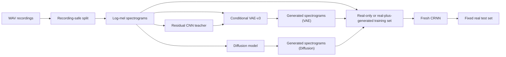

# Project Report Outline

## Document status and constraints

- **Purpose:** Working outline for the final project report.
- **Template:** [`Report_Template.tex`](Report_Template.tex).
- **Submission deadline:** August 14, 11:30 PM.
- **Main-body limit:** At most 5 pages. Appendices and references are excluded.
- **Target compiled length:** Approximately 4.7 pages, leaving about 0.3 pages of formatting margin.
- **Current source of project facts:** the current `main` tree, including the completed protocol-4 low-resource study, CRNN-only generator-quality package, generator-only speed package, and the separate VAE-v3 generated-to-test MSE evidence package.
- **Current writing scope:** Data preparation, Residual CNN, CRNN, and VAE.
- **Deferred scope:** Vincent Wang owns the canonical Diffusion method and citations. Keep the corresponding model headings empty until his material is supplied, while retaining the completed shared comparison and timing protocol.

### Approved compression plan

- Keep the main body at or below five pages; references and appendices may extend the compiled document beyond five pages.
- Keep the pipeline and generated-sample figures, the primary low-resource result table, and compact quality/timing tables in the main body; move detailed diagnostics and protocols to the appendix or tracked evidence packages.
- Describe the V1--V3 evolution in compact prose rather than a separate table.
- Retain one compact VAE objective equation; move architecture minutiae, complete loss derivations, training hyperparameters, leakage audit details, and the full timing procedure to the appendix. State the corrected sampling equation in the main method.
- Merge repeated limitations across methodology, results, discussion, and conclusion.
- Target approximately seven compiled pages including references and a short appendix.

## Confirmed reporting strategy

### Primary research question

> Can generated samples improve bird-species classification in a low-resource setting?

The primary endpoint is the change in macro-F1 of a newly initialized CRNN evaluated on the same fixed real test set:

\[
\Delta F1 = F1_{\text{real+generated}} - F1_{\text{real-only}}.
\]

### Secondary research question

> Under a matched protocol, how do VAE and Diffusion differ in generated-sample quality and in the time required to generate the same number of samples?

The quality comparison considers target-label accuracy, classifier macro-F1, Fréchet distance, feature precision, feature recall, diversity and coverage, copying risk, generation-seed stability, spectrogram inspection, and listening. Generation efficiency is reported separately as both an absolute time gap and a Diffusion-to-VAE time ratio under identical hardware, output count, batch size, precision, and one generator-only timing boundary. The corrected three-seed quality and repeat-level speed sources are now recorded: the VAE pools were regenerated after filtering the existing posterior bank, while the audited Diffusion pools and completed Diffusion timing benchmark were reused without new Diffusion sampling. The completed nine-block low-resource study selected +200/species for both generators and recorded mean paired macro-F1 changes of +2.72 percentage points for VAE-v3 and +1.46 points for Diffusion versus matched real-only controls.

### Claim boundary

- The strongest current result concerns **classifier utility**, not perceptual audio realism.
- VAE reconstruction metrics and generated-sample diagnostics must be kept separate from downstream CRNN macro-F1.
- The Residual CNN is limited to architecture comparison and its frozen training-teacher role. It must not evaluate generated samples.
- The low-resource study simulates label scarcity for three project species while using pretrained generators. It is not a strict rare- or unseen-species experiment.
- Only newly initialized low-resource CRNNs are downstream endpoints; synthetic augmentation of an existing pretrained classifier is outside scope.
- A faster generator is not necessarily a better generator; quality, downstream utility, and runtime are three separate outcomes.
- Runtime claims cover only in-memory generator sampling through the final normalized `128 x 128` log-mel tensor. Loading, file output, plotting, and metric computation are outside the timed region. The models were measured sequentially; the Diffusion benchmark was retained and VAE-v3 was remeasured with the filtered bank.

## Main-body page budget

| Content | Target length |
|---|---:|
| Abstract and Attestation of Teamwork | 0.35 page |
| Introduction and Problem Formulation | 0.65 page |
| Data Preparation | 0.45 page |
| System Design and Models | 1.20 pages |
| Experimental Methodology | 0.40 page |
| Numerical Experiments | 1.10 pages |
| Discussion and Conclusion | 0.55 page |
| **Estimated total** | **4.70 pages** |

References and appendices are outside this budget.

---

## Front matter

### Working title

**BirdGEN: Conditional Bird-Song Spectrogram Generation for Rare Species Classification**

In the report text, clarify that rare-species recognition is the intended application, whereas the recorded experiment simulates labeled-data scarcity for three project species using pretrained generators. Do not convert the title into a claim that the generator was trained on truly rare or unseen species.

### Confirmed author block

- **Shenghao Jin**, Department of Electrical and Computer Engineering, University of Toronto, `shenghao.jin@mail.utoronto.ca`
- **Harvey Li**, Department of Electrical and Computer Engineering, University of Toronto, `harv.li@mail.utoronto.ca`
- **Vincent Wang**, Department of Electrical and Computer Engineering, University of Toronto, `vz.wang@mail.utoronto.ca`

### Abstract

The abstract should contain four elements:

1. **Motivation:** Real bird-song collection and annotation are costly, motivating conditional generation as a source of additional training data.
2. **Task:** Generate three-second log-mel spectrograms for American Robin, Northern Cardinal, and Song Sparrow.
3. **Methods:** Recording-safe data preparation, classifier selection, a class-conditional spatial VAE, a deferred conditional Diffusion model, and matched low-resource CRNN evaluation.
4. **Main conclusion:** In the completed nine-block study, validation selected +200/species for both generators. Mean held-out macro F1 was 84.75% for real-only, 87.48% for VAE-v3, and 86.21% for Diffusion. Keep this newly initialized low-resource CRNN result separate from classifier-view generator diagnostics and from perceptual realism.

Keep the generated-to-test MSE out of the abstract unless space permits. It is a verified auxiliary pixel-space diagnostic for the existing seed-42 notebook pool, not evidence from Harvey's corrected canonical pool and not the primary downstream result.

### Attestation of Teamwork

Correct the template heading from `Assentation` to `Attestation` and use the following concise paragraph:

> Shenghao Jin contributed to data preparation and to the development and evaluation of the conditional VAE. Harvey Li contributed to data preparation, developed and evaluated the Residual CNN and CRNN classifiers, conducted the low-resource synthetic augmentation experiments, and conducted the matched VAE--Diffusion generator-only timing comparison. Vincent Wang developed and evaluated the conditional diffusion model. All members contributed to the preparation and revision of the final report.

---

## 1. Introduction

### 1.1 Motivation

- Bird-song recordings are expensive to collect, clean, and label.
- A classifier trained with few labeled examples can be sensitive to class imbalance and limited recording diversity.
- Conditional generative models may provide additional class-specific spectrograms for training.
- Generator evaluation should therefore ask both whether samples resemble the target data and whether they improve learning on unseen real recordings.

### 1.2 Project scope

- Target species: American Robin, Northern Cardinal, and Song Sparrow.
- Shared high-level representation: three-second, single-channel, `128 x 128` log-mel spectrograms.
- Models covered in the current draft: Residual CNN, CRNN, and VAE-v3.
- The Diffusion section remains structurally present but empty.

### 1.3 Contributions

1. Constructed recording-ID-isolated train, validation, and test manifests and preserved a content-safe evaluation version.
2. Compared multiple classifier architectures and selected a compact CRNN using validation evidence.
3. Developed a species-conditioned spatial VAE with detail-aware and classifier-consistency objectives.
4. Evaluated whether synthetic samples improve a freshly trained CRNN under a matched low-resource protocol.
5. Defined a common generated-sample quality protocol that can later compare VAE and Diffusion.
6. Designed an equal-count benchmark for generator-only spectrogram sampling.

---

## 2. Preliminaries and Problem Formulation

### 2.1 Conditional generation

Given a class label \(y\) and latent variable \(z\), a conditional generator produces a spectrogram

\[
\hat{x} = G(z, y).
\]

The goal is not merely to produce visually plausible arrays. Generated samples should preserve species-relevant structure, remain diverse, avoid copying training examples, and ideally improve a classifier evaluated on untouched real data.

### 2.2 Primary downstream task

Compare two matched pipelines:

- `real-only training data -> fresh CRNN -> fixed real test set`
- `real + generated training data -> fresh identical CRNN -> same fixed real test set`

Primary metrics:

- Macro-F1
- Per-species F1 and recall
- Balanced accuracy or standard accuracy
- Confusion matrix
- Paired \(\Delta F1\) across matched experimental blocks

### 2.3 Secondary generation-quality task

Use common metrics that can be applied to both VAE and Diffusion:

- Generated-to-real pixel-space similarity
- Target-label accuracy and macro-F1 from an independent frozen CRNN
- Classifier-feature Fréchet distance
- Feature precision and feature recall
- Within-class diversity and real-data coverage
- Nearest-neighbor copying risk
- Generation-seed stability
- Qualitative spectrogram and audio inspection

No single metric should be treated as a complete realism score.

---

## 3. Data Preparation

### 3.1 Dataset summary

The audited target subset contains 3,347 clips from 310 original recording IDs:

| Species | Clips | Recording IDs |
|---|---:|---:|
| American Robin | 1,017 | 81 |
| Northern Cardinal | 1,074 | 92 |
| Song Sparrow | 1,256 | 137 |
| **Total** | **3,347** | **310** |

The historical split contains 2,339 training, 519 validation, and 489 test clips. The later `content_safe_v2` manifests retain 519 validation and 489 test rows while removing 24 duplicate training rows:

| `content_safe_v2` split | American Robin | Northern Cardinal | Song Sparrow | Total |
|---|---:|---:|---:|---:|
| Train | 709 | 740 | 866 | 2,315 |
| Validation | 163 | 172 | 184 | 519 |
| Test | 145 | 162 | 182 | 489 |

### 3.2 Split isolation and leakage control

- Clips from one original recording ID remain in one split.
- The historical split is recording-ID isolated.
- A later exact-content audit found duplicate audio between historical train and validation, but none reaching test.
- `content_safe_v2` removes the duplicate training rows while retaining the fixed 519 validation and 489 test rows.
- Maintained generator comparisons and the refreshed low-resource run use a 510-row generator-safe validation subset (163 Robin, 172 Cardinal, and 175 Sparrow), which excludes nine validation rows identified as exact counterparts of historical-training rows.
- The held-out test manifest is unchanged at 489 rows (145 Robin, 162 Cardinal, and 182 Sparrow).
- New claims based on the low-resource experiment should reference the 2,315-row `content_safe_v2` train split, 510-row generator-safe validation subset, and unchanged 489-row test split; they should not describe the historical split as exact-content safe.

### 3.3 Shared geometry and model-specific preprocessing

All covered models use the same high-level geometry: mono audio at 22,050 Hz, three-second duration, FFT size 1,024, hop length 512, and `128 x 128` log-mel arrays. However, `main` preserves two distinct numerical contracts:

| Property | Maintained classifier pipeline | Historical VAE notebook |
|---|---|---|
| Frequency range | 150-10,500 Hz | 0-11,025 Hz |
| Time handling | Centered inference crop/pad | End pad and leading crop; `center=False` |
| Normalization | Per-sample relative dB mapped to `[-1,1]` | Global train mean/std |
| Cached array | `float32 [128,128]`, channel added by dataset | `float32 [1,128,128]` |

The report should therefore say **shared spectrogram geometry with model-specific scaling and adapters**, rather than claiming that every model uses an identical preprocessing implementation.

---

## 4. System Design and Models

### 4.1 End-to-end system

The final LaTeX report can replace this planning diagram with one compact pipeline figure.

### 4.2 Residual CNN classifier

- Approximately 1.66 million trainable parameters.
- A stride-2 convolutional stem followed by six residual blocks.
- Global average and maximum pooling are concatenated before the classifier head.
- Historical held-out result: 90.39% accuracy and 90.44% macro-F1.
- Project roles:
  - Architecture-comparison reference.
  - Frozen semantic teacher in the VAE-v3 feature and label consistency losses.

Because this classifier participates in VAE-v3 training, it is not used to score or compare generated samples.

### 4.3 CRNN classifier

- Approximately 404,451 trainable parameters.
- CNN feature extractor followed by frequency aggregation.
- A bidirectional GRU models the remaining 16-step temporal sequence.
- Temporal mean and maximum pooling feed the final classifier head.
- Controlled three-seed validation result: 90.45% +/- 1.45% macro-F1.
- The validation-selected seed-777 checkpoint obtained 89.98% accuracy and 90.16% macro-F1 on 489 held-out real clips.

The report must distinguish two uses:

1. A frozen CRNN provides classifier-view diagnostics for generated samples.
2. A newly initialized CRNN is trained for every augmentation condition and supplies the primary downstream macro-F1 result.

### 4.4 Conditional VAE-v3

Begin the VAE introduction with a compact evolution table:

| Version | Main change | Reason for the change |
|---|---|---|
| VAE-v1 | First working CVAE: flat 128-value latent, species embeddings concatenated at the encoder/decoder, MSE plus KL, and standard-normal sampling | Established the conditional-generation pipeline, but the compressed vector and pixel-MSE objective blurred narrow calls, pitch tracks, and transient structure |
| VAE-v2 | Replaced the flat bottleneck with a `16 x 8 x 8` spatial latent; added residual FiLM blocks, resize-convolution, event-weighted multiscale/gradient reconstruction, and a per-species moment-matched posterior Gaussian | Preserved time-frequency location and local detail while reducing the train-posterior versus standard-normal sampling mismatch |
| VAE-v3 | Expanded the latent to `16 x 16 x 16`; added per-channel free bits, longer/lower-weight KL warmup, frozen-classifier feature/label consistency, and a posterior-anchor mixture with corrected temperature `0.35` | Targeted the remaining loss of fine detail and species-discriminative structure, while retaining neighboring latent correlations during sampling |

The evolution should be presented as an engineering response to observed limitations, not as a controlled causal ablation: architecture, loss, and sampling method changed together.

- Input: `[1,128,128]` globally standardized log-mel spectrogram.
- Spatial latent: `[16,16,16]`, or 4,096 latent values.
- Approximately 5.37 million trainable parameters.
- Species embeddings condition residual encoder and decoder blocks through FiLM.
- Objective components:
  - Event-weighted reconstruction
  - Multi-scale reconstruction
  - Temporal- and frequency-gradient reconstruction
  - KL regularization with warmup and free bits
  - Frozen Residual CNN feature consistency
  - Frozen Residual CNN class-label consistency
- Generation uses a per-species posterior-anchor bank fitted only on the training split.

The corrected reparameterization is

\[
z = \mu + 0.35\,\mathrm{std}\odot\epsilon,
\qquad \epsilon \sim \mathcal{N}(0,I).
\]

In implementation terms, this is exactly `z = mu + 0.35*std*epsilon`; the temperature scales the sampled standard-deviation term, not merely a metadata field. The VAE checkpoint was not retrained. Its existing posterior bank was filtered against the current training manifest to 256 Northern Cardinal, 247 Song Sparrow, and 256 American Robin anchors, and all three VAE generation pools were regenerated from that filtered bank.

The posterior-anchor method creates stochastic variants around encoded training examples. It is not an independent unconditional prior, and generated manifests retain the anchor identity for auditability.

### 4.5 Diffusion Model

<!-- Intentionally left blank for Vincent Wang's canonical Diffusion method and citations. -->

---

## 5. Experimental Methodology

### 5.1 Classifier architecture selection

- Compared Residual CNN, Plain CNN, Depthwise CNN, and CRNN.
- Used the same historical recording-isolated splits, preprocessing, optimizer family, width, dropout, early-stopping rule, and seeds 42, 123, and 777.
- Selected architectures and checkpoints using validation results only.
- Evaluated the selected CRNN once on the held-out test split.
- Treat this as practical model selection, not a parameter-matched causal ablation.

### 5.2 VAE reconstruction and generation evaluation

Keep three evidence categories separate:

1. **Paired reconstruction:** MSE, MAE, spectral convergence, and gradient preservation between each test input and its deterministic reconstruction.
2. **Unpaired generated-sample quality:** Generated-to-real MSE, independent-CRNN target-label accuracy, independent-CRNN macro-F1, classifier-feature Fréchet distance, feature precision, feature recall, diversity, coverage, copying risk, and qualitative inspection.
3. **Downstream utility:** Macro-F1 of a fresh CRNN trained with or without generated samples.

### 5.3 Matched low-resource augmentation protocol

- Expose 50 real training spectrograms per species to the downstream CRNN.
- Use one unique recording ID for each selected real row.
- Cross three deterministic real-subset seeds with three CRNN initialization seeds to form nine matched blocks.
- Rotate generation-pool seeds across blocks.
- Within every matched block, evaluate exactly `50+0`, `50+50`, `50+100`, and `50+200` real-plus-generated samples per species, separately for each generator.
- Use the same CRNN architecture, real validation/test sets, optimizer-step budget, and masking policy for every matched condition.
- Select the augmentation ratio on validation only; evaluate only the baseline and selected condition on test.
- Do not augment an existing pretrained CRNN, and do not use the Residual CNN as a generated-sample evaluator.

### 5.4 Common VAE-Diffusion quality and generation-time protocol

The recorded quality comparison uses the same sample count per species, generation seeds, preprocessing conversion, frozen evaluator, and real reference sets. VAE and Diffusion values remain separate by seed rather than pooling away generation instability.

For the generation-time comparison, use the same balanced count already specified for one checkpoint-evaluation seed: 200 samples per species and therefore 600 samples per model in each timed repeat. The quality study uses seeds 42, 123, and 777, or 1,800 samples per model in total; those three generation seeds are not substitutes for repeated system timing. The recorded benchmark used the same RTX 4070 SUPER, batch size 8, FP32 precision, identical output shape, five warm-up batches, and five synchronized repeats per model. Hardware/software metadata, sampler settings, repeat measurements, and peak accelerator memory are retained in the speed package.

Use one timing boundary:

1. **Generator-only spectrogram time:** Start with the frozen checkpoint and any VAE posterior bank already loaded; after five unmeasured warm-up batches and device synchronization, time class-conditioned sampling through the final normalized `128 x 128` log-mel tensor. Exclude checkpoint loading, cache validation, array writing, plotting, and metric computation. Existing arrays cannot be counted as a timed generation.

CUDA was synchronized immediately before and after each timed region. The models were measured sequentially rather than interleaved: the completed Diffusion benchmark was retained and VAE-v3 was remeasured afterward with the filtered 759-anchor bank. No Diffusion sampling was rerun. Repeats reuse the same deterministic sample streams, so their variation measures system runtime variation rather than different generated populations. Retain every repeat-level timing and report the median and interquartile range, seconds per 600 samples, milliseconds per sample, samples per second, the absolute gap

\[
\Delta T = T_{\mathrm{Diffusion}} - T_{\mathrm{VAE}},
\]

and the paired slowdown factor

\[
R_T = \frac{T_{\mathrm{Diffusion}}}{T_{\mathrm{VAE}}}.
\]

The benchmark uses the final verified VAE sampler and the reported 100-step DDIM sampler. Any future change in VAE temperature, Diffusion step count, guidance, batch size, or precision requires a new timing run. Preserve repeat-level seconds, throughput, hardware, precision, batch size, timing boundary, sampler settings, and peak accelerator memory. **Reporting owner: Harvey Li.**

---

## 6. Numerical Experiments

### 6.1 Classifier selection and held-out performance

Use one compact table:

| Model | Parameters | Validation macro-F1 | Held-out test macro-F1 | Report role |
|---|---:|---:|---:|---|
| Residual CNN architecture sweep | 1.66M | 87.44% +/- 0.97% | Not used for final selection | Architecture comparison |
| Residual teacher checkpoint | 1.66M | Historical validation selection | 90.44% | Architecture reference and frozen VAE teacher |
| CRNN | 404K | 90.45% +/- 1.45% | 90.16% | Primary downstream classifier |

The historical Residual test checkpoint is not one of the three architecture-sweep test results and should not be merged with them as if it were the same run.

### 6.2 VAE reconstruction and generated-sample quality

#### Recorded paired test reconstruction results

The existing VAE-v3 report evaluates every held-out test spectrogram against its own deterministic reconstruction:

| Metric | VAE-v2 | VAE-v3 |
|---|---:|---:|
| Test reconstruction MSE | 0.0654 | **0.0281** |
| Test reconstruction MAE | 0.1894 | **0.1261** |
| Spectral convergence | 0.2727 | **0.1794** |

The exact recorded VAE-v3 test MSE is `0.02806341195581881`. This is

\[
\operatorname{MSE}_{\text{recon,test}}
= \frac{1}{N}\sum_i \operatorname{MSE}\left(x_i,\operatorname{Dec}(\mu(x_i),y_i)\right),
\]

not an MSE between independent generated samples and arbitrary real test examples.

#### Presentation feedback: generated versus real test MSE

The frozen evaluation compares the existing VAE-v3 seed-42 notebook pool with [`artifacts/spectrograms/manifests/spectrogram_test.csv`](../../artifacts/spectrograms/manifests/spectrogram_test.csv), the local held-out test set containing 489 samples (American Robin 145, Northern Cardinal 162, and Song Sparrow 182), in the shared `standardized_logmel_float32` domain. Both inputs have shape `[1,128,128]`, so no numerical conversion was applied; the auxiliary `classifier_input` arrays were not used. For every generated spectrogram, the protocol records the pixel-MSE-nearest test spectrogram of the same species. The real reference applies the corresponding leave-one-out rule to every test spectrogram, excluding the query itself and restricting neighbors to the same species. The summaries contain count, mean, standard deviation, median, Q1, Q3, minimum, and maximum. Because they contain 48 generated queries and 489 real queries, the two distributions are not paired.

Generated-to-test nearest-neighbor MSE, from [`summary.csv`](../../reports/generated_to_test_mse_v1/vae_v3_notebook_seed42/summary.csv):

| Species | Count | Mean | SD | Median | Q1 | Q3 | Min | Max |
|---|---:|---:|---:|---:|---:|---:|---:|---:|
| Overall | 48 | 0.5120 | 0.1998 | 0.4501 | 0.3878 | 0.6231 | 0.2054 | 1.2559 |
| American Robin | 16 | 0.4308 | 0.1122 | 0.4153 | 0.3692 | 0.4632 | 0.2637 | 0.6913 |
| Northern Cardinal | 16 | 0.5579 | 0.1689 | 0.5849 | 0.4442 | 0.6602 | 0.2054 | 0.8250 |
| Song Sparrow | 16 | 0.5474 | 0.2708 | 0.4488 | 0.3865 | 0.6395 | 0.2438 | 1.2559 |

Real-to-real leave-one-out nearest-neighbor MSE:

| Species | Count | Mean | SD | Median | Q1 | Q3 | Min | Max |
|---|---:|---:|---:|---:|---:|---:|---:|---:|
| Overall | 489 | 0.3350 | 0.1419 | 0.3185 | 0.2368 | 0.4154 | 0.0063 | 0.9368 |
| American Robin | 145 | 0.3237 | 0.1310 | 0.3019 | 0.2343 | 0.4256 | 0.0969 | 0.7061 |
| Northern Cardinal | 162 | 0.3650 | 0.1816 | 0.3435 | 0.2290 | 0.4625 | 0.0063 | 0.9368 |
| Song Sparrow | 182 | 0.3175 | 0.1005 | 0.3064 | 0.2421 | 0.3756 | 0.1419 | 0.7630 |

The pool was reconstructed during the frozen evaluation from the existing [`conditional_vae_v3_best.pt`](../../artifacts/models/vae/conditional_vae_v3/conditional_vae_v3_best.pt) checkpoint and [`04_conditional_vae.ipynb`](../../notebooks/04_conditional_vae.ipynb). It used seed 42, generation-stream seed 142, temperature `0.35`, CUDA, 16 samples per species, and the existing posterior bank fitted on the train split only. The durable evidence is packaged in [`protocol.json`](../../reports/generated_to_test_mse_v1/vae_v3_notebook_seed42/protocol.json), which records the input hashes and confirms that the test set was used only for this final frozen evaluation. This is the existing notebook-generated pool, not Harvey's corrected canonical pool and not an evaluation involving Harvey's current CRNN.

The generated-to-test mean (`0.5120`) is higher than the real-to-real reference (`0.3350`) by approximately `0.1770` in this pixel representation. This is only a same-species, unpaired nearest-neighbor proximity diagnostic: it does not establish perceptual realism, waveform quality, or downstream usefulness. A very low nearest-neighbor MSE can reward copying or limited diversity, so the result must be interpreted with diversity and copy-risk evidence rather than as a standalone realism score. The recorded overall paired test-reconstruction MSE (`0.028063`) is sufficient for the VAE reconstruction diagnostic; a per-species paired-reconstruction breakdown is optional appendix analysis, not a required report output.

#### Presentation feedback: generated-result images

Use the existing `3 species x 4 samples` VAE-v3 notebook figure in the main body:

- One row per species and four generated samples per row.
- The existing panels are independently color-normalized; disclose this rather
  than claiming a shared scale.
- Caption must identify these as posterior-anchor generated samples, not test reconstructions.
- Caption must state that spectrogram appearance alone does not establish waveform realism.

Source: [`conditional_samples.png`](../../reports/vae/conditional_vae_v3/conditional_samples.png), with the 48-row notebook-pool inventory in [`generated_manifest.csv`](../../reports/vae/conditional_vae_v3/generated_manifest.csv). This figure uses the existing notebook pool at temperature `0.35`, not Harvey's corrected canonical pool.

Put the full original/reconstruction/residual grid in the appendix: [`test_reconstructions.png`](../../reports/vae/conditional_vae_v3/test_reconstructions.png).

Keep the fresh VAE and Diffusion quality results source-driven and separate.
Values below are three-generation-seed means; feature rows also average the
three species:

| Metric | VAE-v3 | Diffusion | Required source |
|---|---:|---:|---|
| Target-label accuracy | 96.67% | 92.44% | Selected-CRNN scores and confusion matrices |
| Selected-CRNN macro-F1 | 96.66% | 92.42% | Per-seed classifier scores |
| Classifier-feature Fréchet distance | 22.8950 | 41.2550 | Per-seed feature statistics |
| Feature precision / recall | 0.8528 / 0.8972 | 0.5654 / 0.8207 | Per-seed feature precision/recall output |
| Feature density / coverage | 0.6423 / 0.7419 | 0.3114 / 0.4845 | Per-seed manifold output |
| Diversity ratio | 0.8719 | 1.0083 | Generated versus real feature diversity |
| Pixel Wasserstein / near-train fraction / exact copies | 0.0787 / 36.67% / 0 | 0.1916 / 2.50% / 0 | Per-seed pixel and nearest-neighbor output |

### 6.3 Primary result: low-resource augmentation

Use the exact nine-block design and its completed validation selection as the main downstream table:

| Condition per species | Generator branch | Validation across nine matched blocks | Test status |
|---|---|---|---|
| `50+0` | None | Shared real-only reference completed | Evaluated as the shared baseline |
| `50+50` | VAE-v3 and Diffusion separately | Mean validation macro F1: 84.53% / 85.45% | Not selected for test |
| `50+100` | VAE-v3 and Diffusion separately | Mean validation macro F1: 85.88% / 86.06% | Not selected for test |
| `50+200` | VAE-v3 and Diffusion separately | Mean validation macro F1: 86.47% / 86.84% | Selected independently for both generators |

The held-out test table contains only `50+0` and the selected +200 ratio for each generator:

| Test condition | Mean macro F1 | Mean paired change | Descriptive block-bootstrap interval | Positive blocks |
|---|---:|---:|---:|---:|
| Real-only | 84.75% | Reference | Reference | Reference |
| VAE-v3 +200/species | 87.48% | +2.72 points | +1.00 to +4.65 points | 7/9 |
| Diffusion +200/species | 86.21% | +1.46 points | +0.15 to +2.89 points | 6/9 |

These intervals resample the nine matched blocks and are descriptive, not p-values or test-recording confidence intervals. The final portable evidence is in [`reports/crnn_low_resource_augmentation_2026-08-12`](../../reports/crnn_low_resource_augmentation_2026-08-12/README.md); bulk checkpoints remain under ignored `runs/crnn_low_resource_augmentation/v3/`.

### 6.4 VAE-Diffusion Generation Quality and Equal-Count Runtime Comparison

Do not combine the heterogeneous quality metrics into a single unsupported ranking. VAE-v3 is stronger on selected-CRNN compatibility and most feature-distribution diagnostics, while Diffusion has a diversity ratio nearer one and far fewer near-training feature flags. Neither establishes human-perceived realism.

#### Presentation feedback: time to generate the same number of spectrogram samples

The matched generator-only benchmark uses FP32, batch size 8, five warm-up batches, five CUDA-synchronized repeats, and the same RTX 4070 SUPER:

| Model | Outputs per timed repeat | Generator sampler | Repeat seconds (median, IQR) | ms/sample | samples/s | Peak accelerator memory |
|---|---:|---|---:|---:|---:|---:|
| VAE-v3 | 600 (200/species) | Corrected posterior-anchor sampler | 0.3046 [0.2983, 0.3076] | 0.510 | 1963.276 | 0.185 GiB |
| Diffusion | 600 (200/species) | 100-step DDIM | 411.1814 [410.9396, 411.2319] | 687.182 | 1.455 | 0.333 GiB |
| Diffusion minus VAE / ratio | Same count | Matched comparison | 412.0032 mean-second gap / 1348.09 x mean-time ratio |  |  |  |

The sample means and sample standard deviations were 0.3058 +/- 0.0096 seconds for VAE-v3 and 412.3090 +/- 2.8120 seconds for Diffusion. Report every repeat-level value in the appendix. In the main text, state both the absolute difference and the slowdown factor, explain that iterative Diffusion sampling and a single VAE decoder pass have different computational structures, and disclose the sequential measurement sequence. The comparison is explicitly generator-only spectrogram sampling. **This result will be presented by Harvey Li.**

---

## 7. Discussion

### 7.1 Answer to the primary question

Yes, within the simulated label-scarcity protocol. Validation selected the largest tested ratio, +200/species, for both generators. Against the matched real-only mean macro F1 of 84.75%, VAE-v3 reached 87.48% (+2.72 points; 7/9 positive blocks; descriptive interval +1.00 to +4.65) and Diffusion reached 86.21% (+1.46 points; 6/9; +0.15 to +2.89). This supports classifier utility for newly initialized low-resource CRNNs under the tested grid; it does not establish a continuous optimum, utility for the historical full-data CRNN, or performance on genuinely rare species.

### 7.2 Answer to the secondary question

The corrected VAE-v3 pools have higher selected-CRNN compatibility and stronger average feature precision and coverage than Diffusion, but they also have substantially more near-training feature flags. Diffusion has a diversity ratio nearer one. Under the recorded generator-only boundary, Diffusion took 1348.09 x the VAE-v3 generator time. These metric-specific findings do not establish perceptual realism or downstream classifier utility.

### 7.3 Limitations and validity boundaries

- **Training-time classifier coupling:** The Residual CNN contributes to the VAE loss and is therefore retained only as a frozen training teacher, never as a generated-sample evaluator.
- **Closed-set evaluator:** The CRNN cannot reject noise, unknown species, or arbitrary out-of-distribution inputs.
- **Label scarcity rather than strict rare-species generation:** The pretrained VAE saw more source data than the 50 examples visible to each downstream CRNN.
- **Overlapping real subsets:** The three low-resource real subsets overlap because the source split contains a limited number of recording IDs.
- **Ratio boundary:** `+200/species` is the largest tested value, not an estimated optimum.
- **Historical validation duplicates:** Earlier architecture results used recording-isolated manifests with exact-content overlap between train and validation; no duplicate reached test. The maintained comparisons use the 510-row generator-safe validation subset and unchanged 489-row test set.
- **Preprocessing drift:** Historical VAE and maintained classifier pipelines share geometry but not identical numerical normalization.
- **Unpaired MSE limitation:** Generated-to-test nearest-neighbor MSE measures proximity and can reward copying; it must be interpreted with diversity and copy-risk diagnostics.
- **Waveform boundary:** Spectrogram and classifier metrics do not replace listening or waveform-quality evaluation.
- **Timing boundary:** Runtime depends on hardware, batch size, precision, sampler configuration, warm-up, synchronization, and whether loading, decoding, or file I/O is included; timing claims are valid only for the documented benchmark setting.
- **Canonical VAE refresh:** The portable pool generator applies `z = mu + 0.35*std*epsilon`. The VAE checkpoint was not retrained; the existing posterior bank was filtered to 256 Northern Cardinal, 247 Song Sparrow, and 256 American Robin anchors, and all three canonical VAE pools were regenerated. Shenghao's separate notebook-pool MSE package remains an independent evidence stream and was not substituted for these pools.

---

## 8. Conclusion

The conclusion should answer both research questions in two short paragraphs:

1. **Primary question:** Report that both validation-selected +200/species arms improved mean held-out macro F1 versus their matched real-only controls: +2.72 points for VAE-v3 and +1.46 points for Diffusion across nine blocks, with the caveats above.
2. **Secondary question:** Report the corrected-pool quality trade-offs and the 1348.09 x Diffusion-to-VAE generator-time ratio from the current per-seed and repeat-level sources; keep quality, runtime, and downstream utility as separate outcomes.

End with one forward-looking sentence about verified generation pipelines, perceptual listening, and extending the protocol to genuinely rare or unseen species.

---

## References

The final bibliography should minimally cover:

- Variational autoencoders and conditional VAEs
- FiLM conditioning
- Free-bits or KL stabilization
- Perceptual or feature-consistency loss
- CRNN-based audio classification
- The selected Diffusion formulation when that section is added
- Any external benchmark or implementation used for comparison

Every external fact, benchmark, or borrowed implementation must be cited. Project-specific numbers should point to the recorded artifacts rather than an external citation.

---

## Appendix plan

The appendix can contain:

- Complete preprocessing and model hyperparameters
- Full classifier architecture comparison
- Per-seed training histories
- Confusion matrices and per-species metrics
- VAE training curves
- Full original/reconstruction/residual images
- Additional generated samples
- Latent PCA
- Detailed generated-to-test MSE distributions
- Diversity, coverage, and nearest-neighbor copy-risk results
- Repeat-level generator-only spectrogram-sampling measurements, together with generation seeds, model order, hardware, precision, batch size, sampler settings, timing boundary, peak accelerator memory, and software details
- Data and provenance audits
- A checklist mapping every presentation feedback item to its final-report location

---

## Presentation feedback checklist

| Feedback item | Required report response | Planned location | Status |
|---|---|---|---|
| VAE needs MSE on the test set | Report overall paired test reconstruction MSE (`0.028063`) | Section 6.2 | Recorded; per-species paired-reconstruction MSE is optional |
| Compare generated samples with original real test data | Compute same-species generated-to-test nearest-neighbor MSE plus real-to-real baseline | Section 6.2 | Completed for Shenghao's separate VAE-v3 notebook seed-42 pool |
| Show generated results | Include compact three-species generated-spectrogram grid | Section 6.2 | Completed using the existing VAE-v3 notebook figure; independent panel normalization is disclosed |
| Apply VAE temperature inside reparameterization | Use `z = mu + 0.35*std*epsilon`; do not retrain the checkpoint; filter the existing bank and regenerate VAE pools | Sections 4.3 and 6.2 | Recorded: bank 256/247/256; all three VAE pools regenerated |
| Compare VAE and Diffusion time for the same number of spectrogram samples | Generate 600 samples/model/repeat for five synchronized repeats; report generator-only seconds, throughput, peak accelerator memory, absolute gap, and time ratio | Sections 5.4 and 6.4; presented by Harvey | Recorded; sequential measurement sequence disclosed |
| Avoid new Diffusion generation | Reuse the three audited DDIM pools and retain the completed Diffusion benchmark | Sections 5.4 and 6.2 | Recorded; no Diffusion spectrogram generation rerun |
| Preserve the matched low-resource design | Keep exactly nine blocks with `50+0` and separate VAE/Diffusion `50+50/100/200` conditions | Sections 5.3 and 6.3 | Completed: 63 validation runs, 27 selected-arm test evaluations, protocol 4 |

Add every additional question from the presentation to this table before submission.

---

## Evidence map

### Template and project overview

- [`Report_Template.tex`](Report_Template.tex)
- [`README.md`](../../README.md)

### Data preparation

- [`01_dataset_audit.ipynb`](../../notebooks/01_dataset_audit.ipynb)
- [`01_create_splits.py`](../../scripts/01_create_splits.py)
- [`content_safe_v2/protocol.json`](../../manifests/content_safe_v2/protocol.json)
- [`spectrogram.json`](../../configs/spectrogram.json)
- [`audio.py`](../../src/bird_song/audio.py)
- [`02_preprocess_logmel.ipynb`](../../notebooks/02_preprocess_logmel.ipynb)

### Classifiers

- [`model.py`](../../src/bird_song/classifier/model.py)
- [`architecture_comparison/summary.csv`](../../artifacts/models/classifier/architecture_comparison/summary.csv)
- [`selected_crnn/metrics.json`](../../artifacts/models/classifier/selected_crnn/metrics.json)
- [`Harvey_classifier/README.md`](../../artifacts/models/classifier/Harvey_classifier/README.md)

### VAE

- [`04_conditional_vae.ipynb`](../../notebooks/04_conditional_vae.ipynb)
- [`conditional_vae_v3/run_summary.json`](../../reports/vae/conditional_vae_v3/run_summary.json)
- [`conditional_samples.png`](../../reports/vae/conditional_vae_v3/conditional_samples.png) and its [`generated_manifest.csv`](../../reports/vae/conditional_vae_v3/generated_manifest.csv)
- [`test_reconstructions.png`](../../reports/vae/conditional_vae_v3/test_reconstructions.png)
- [`Generated-to-test MSE reference`](../../docs/Generated_to_test_MSE_reference.md)
- [`Generated-to-test MSE summary`](../../reports/generated_to_test_mse_v1/vae_v3_notebook_seed42/summary.csv)
- [`Generated-to-test MSE protocol`](../../reports/generated_to_test_mse_v1/vae_v3_notebook_seed42/protocol.json)
- [`Generated-to-test MSE per-sample audit`](../../reports/generated_to_test_mse_v1/vae_v3_notebook_seed42/per_sample.csv)
- [`checkpoint_models.py`](../../src/bird_song/generation/checkpoint_models.py)
- [`checkpoint_pool.py`](../../src/bird_song/generation/checkpoint_pool.py)
- [`checkpoint_evaluation.py`](../../src/bird_song/generation/checkpoint_evaluation.py)
- [`generator_checkpoint_evaluation_2026-08-12`](../../reports/generator_checkpoint_evaluation_2026-08-12/README.md)
- [`generator_speed_comparison_2026-08-12`](../../reports/generator_speed_comparison_2026-08-12/README.md)

### Low-resource evaluation

- [`15_crnn_low_resource_augmentation.py`](../../scripts/15_crnn_low_resource_augmentation.py)
- [`crnn_low_resource_augmentation_2026-08-12`](../../reports/crnn_low_resource_augmentation_2026-08-12/README.md): final `50+0`, `50+50`, `50+100`, and `50+200` validation evidence and selected-arm held-out results

---

## Final-report completion status

The Data Preparation, Residual CNN architecture comparison, CRNN, VAE method, recorded reconstruction, and low-resource outcome are supported by the current repository. The table distinguishes completed evidence from the remaining owner inputs and team decisions.

| Item | Input or decision | Owner | What must be provided or recorded | Current status |
|---:|---|---|---|---|
| 1 | Final author block | Team | Final title; exact names; department/program; affiliation; submission email addresses | Completed |
| 2 | Portable VAE temperature alignment | Harvey | Match the sampler with `z = mu + 0.35 * sigma * epsilon` and retain a regression test | Completed and integrated on `main` |
| 3 | Corrected canonical VAE pools and downstream rerun | Harvey | Generate seeds 42, 123, and 777 from the filtered bank and rerun the affected low-resource CRNN experiment without resuming old checkpoints | Completed: three 600-sample VAE pools, 63 validation runs, 27 held-out evaluations, and protocol-4 evidence |
| 4 | Generated-to-test MSE package | Shenghao | Implement same-species generated-to-test nearest-neighbor MSE, the test-to-test leave-one-out baseline, overall/per-species summaries, and distribution statistics | Completed and verified for the existing VAE-v3 notebook seed-42 pool; rerun only if the final report switches to Harvey's corrected pool |
| 5 | Diffusion evaluation evidence package | Harvey, using Vincent's model evidence | Checkpoint and DDIM settings; reused-pool provenance; CRNN-only quality metrics and figures; limitations | Completed without regenerating Diffusion spectrograms |
| 6 | Equal-count generator-only timing package | Harvey | Five 600-output repeats/model; measurement sequence; seeds; hardware/software; batch size; precision; warm-up/synchronization; peak memory; sampler settings | Completed and packaged with repeat-level evidence |
| 7 | Complete presentation feedback | Team | Confirm that the three recorded questions plus equal-count runtime are the complete feedback list, or provide the missing questions and requested additions | Awaiting team confirmation |
| 8 | Diffusion method and references | Vincent Wang | Canonical architecture, training objective, conditioning/sampling description, and supporting citations | Awaiting Vincent's material |
| 9 | Final title scope | Team | Decide whether to retain “Rare Species Classification” or rename it to emphasize the simulated low-resource/label-scarcity setting | Pending |

The professor-confirmed runtime scope is generator-only spectrogram sampling. Do not broaden the comparison beyond that boundary.

---

## Open items before finalizing the LaTeX

- [x] Confirm final title, author affiliations, and email addresses.
- [x] Align and integrate the portable VAE pool sampler with the temperature-`0.35` formula.
- [x] Bind future pool resumes to checkpoint SHA-256, posterior-bank SHA-256, and Git revision; legacy schema-3 metadata is not reusable under the new schema-4 guard.
- [x] Regenerate seeds 42, 123, and 777 in fresh canonical VAE pool directories using the filtered posterior bank.
- [x] Rerun the affected low-resource CRNN experiment from a fresh run root using the corrected pools.
- [x] Use the recorded overall test-reconstruction MSE for the VAE diagnostic; treat a per-species paired-reconstruction breakdown as optional appendix analysis rather than a required output.
- [x] Implement generated-to-test and real-to-real baseline MSE metrics.
- [x] Run and verify the metrics for the existing VAE-v3 notebook seed-42 pool; record overall and per-species distributions.
- [x] Keep the existing notebook-pool MSE evidence; no corrected-pool MSE rerun or raw-pool inclusion is required for the report.
- [x] Insert the existing VAE-v3 `3 x 4` generated-sample figure and disclose its independently normalized panels and notebook-pool provenance.
- [x] Use generator-only spectrogram sampling as the sole runtime boundary.
- [x] Record five fresh in-memory 600-sample repeats per model with raw timings, measurement sequence, seeds, hardware/software metadata, peak memory, and exact sampler settings.
- [x] Compute the 412.0032-second VAE--Diffusion generator-only time gap and 1348.09 x Diffusion/VAE time ratio; Harvey owns and presents this result.
- [x] Complete and package the exact nine-block low-resource study: 63 validation runs, 27 held-out evaluations, and protocol-4 provenance.
- [x] Keep the V1--V3 engineering progression as compact prose in the five-page body; omit the full comparison table.
- [ ] Vincent: add the canonical Diffusion model-method description and citations; retain the completed shared evaluation results and protocol unchanged.
- [ ] Add all presentation feedback items and verify that each is addressed.
- [ ] Team: decide whether the final title retains “Rare Species Classification” or explicitly says “Low-Resource Classification.”
- [x] Build and visually inspect the PDF: five main-body pages, one reference page, and one appendix page (seven pages total).
- [x] Verify the report's numerical claims against the tracked manifests, model summaries, evaluation CSV/JSON packages, and documented timing run.
